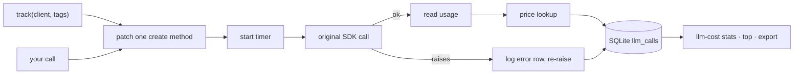

# llm-cost-tracker — per-feature, per-user LLM spend in your own database

[](https://github.com/darrshangovender/llm-cost-tracker/actions/workflows/tests.yml)
[](LICENSE)
[](https://python.org)
[](https://sqlite.org)

> A thin wrapper around the OpenAI and Anthropic clients that records prompt tokens, completion tokens, model, latency and cost for every call, tagged with your own application context. Logs to SQLite. Ships a CLI for slicing the result.

**Why this exists.** Every team building on LLMs hits the same wall: "what is my cost per customer this month?" Provider dashboards aggregate at the API-key level, not the feature or customer level, so the question is unanswerable from their side. This moves the bookkeeping to your side, into your database, where a `GROUP BY` can reach it.

Pairs with [prompt-versioner](https://github.com/darrshangovender/prompt-versioner) — tag calls with the prompt version it routed to and you get cost per prompt version.

---

## Quick start

```bash
pip install -e ".[anthropic,dev]"     # or ".[openai,dev]"
```

```python
from anthropic import Anthropic
from llm_cost_tracker import track, Store

store = Store("llm_calls.db")
client = track(Anthropic(), tags={"feature": "rag-chatbot", "user_id": "u_123"}, store=store)

resp = client.messages.create(
    model="claude-sonnet-4-5", max_tokens=512,
    messages=[{"role": "user", "content": "..."}],
)
# One row written: provider, model, tokens in/out, cost_usd, latency_ms, tags, error
```

```bash
llm-cost stats --since 24h
llm-cost top --by feature --since 7d
llm-cost top --by user_id --limit 10
llm-cost export --format csv > spend.csv
```

Override the price table for a fine-tune or a model that shipped after this release:

```python
from llm_cost_tracker import set_price
set_price("my-fine-tune-v1", input=0.50, output=1.50)   # USD per 1M tokens
```

## How it works



1. `track()` detects the provider from the client's class and replaces exactly one method — `messages.create` or `chat.completions.create`.
2. Your code calls the client normally. Nothing else in your call site changes.
3. The wrapper starts a timer and reads the model from kwargs.
4. The original SDK method runs. **On exception, a row is logged with zero tokens and the error string, then the exception is re-raised** — a failed call still cost you latency and often tokens.
5. On success, usage is read from whichever field the provider uses.
6. `estimate_cost` looks the model up in the price table; unknown models yield `None`.
7. One row is inserted and committed. The CLI aggregates with plain SQL, extracting tag keys via `json_extract`.

## Design decisions

| Decision | Why |
|---|---|
| **A wrapper, not a metering proxy** | A proxy adds a hop, a failure surface, and a deployment dependency. A wrapper stays in your process and can see first-class application context — `user_id`, `feature`, `request_id` — that a proxy would have to receive through headers you'd have to plumb anyway. |
| **Failed calls are logged too** | A 400 from a malformed prompt still burned latency, and a truncated response still burned tokens. A cost table that only records successes understates exactly the spend you most want to find. |
| **Unknown models price to `None`, not to zero** | Silently defaulting a price is how you get a cost report that's wrong and confident. `None` is at least detectable — though see the first limitation for where that intent currently leaks. |
| **SQLite by default** | One file, zero infra. Drop it into a hobby project at no cost, and the store surface is small enough that a real adapter is a contained piece of work. |
| **Tags are arbitrary JSON** | Your cost dimensions are yours. The CLI's `--by` works against any key you've written. |

## Limitations

- **SQL injection via the CLI's `--by` argument.** The tag key is f-string-interpolated straight into the `json_extract` path. Only the time window and limit are parameterised. Do not expose the CLI to untrusted input, and fix this before wiring it into anything automated.
- **Only two synchronous, non-streaming methods are instrumented.** Streaming calls, `AsyncAnthropic` / `AsyncOpenAI`, the Responses API, embeddings, and the batch APIs all pass through **untracked and unwarned** — so the database looks complete while missing spend. This is the most dangerous property of the library, because the failure is silent and looks like a low bill.
- **Unknown models silently report $0.00.** `price_for` correctly returns `None`, but the CLI coalesces it away with `or 0`, so an unpriced model shows zero spend rather than an unknown. The price table is a hardcoded snapshot with no cache-read, cache-write, batch, or tiered pricing modelled.
- **Concurrency is unsound despite the docstring.** One connection is shared with `check_same_thread=False`, committed per insert, with no lock. Concurrent request threads race and can raise `database is locked` **inside the LLM call path** — turning a bookkeeping tool into a source of production errors.
- **Tags are a single shared mutable dict** held by the wrapper and passed by reference into every row. In a multi-threaded server, one request's mutation is attributed to concurrent requests.
- **`default_store()` is a process-wide singleton at `./llm_calls.db`**, so a CLI invoked from a different directory silently reads an empty database. There is no rotation, retention, or size bound on an append-only table.
- **There is no Postgres or DB-API adapter.** `Store` hardcodes `sqlite3.connect`; the "any DB-API connection" and "swap to Postgres with one line" claims have been removed from this README because no such seam exists.
- **The `<1ms overhead` claim has been removed** — there is no benchmark in this repo, and the sample CLI output above is a format illustration, not measured data.

## Project layout

```
llm-cost-tracker/
├── llm_cost_tracker/
│   ├── wrapper.py       # track(): provider detection + one patched method
│   ├── pricing.py       # Price table (USD per 1M tokens), price_for, set_price
│   ├── store.py         # Call dataclass + SQLite store + default_store()
│   └── cli.py           # llm-cost stats · top · export
└── tests/               # 1 test
```

The schema is one wide table: `id, ts, provider, model, input_tokens, output_tokens, cost_usd, latency_ms, tags_json, error`, indexed on timestamp and model.

## Tests

```bash
pytest tests/ -q         # 1 test
```

Honest state: there is **one** test — a fake client through the Anthropic path asserting a row lands with the right model, tokens and a non-null cost. The OpenAI path, the CLI, `parse_since`, and the error path are all uncovered. For a library whose output is a spend number people will act on, that is the gap to close first, and the `--by` injection above is what an adversarial test would have caught.

## Author

Darrshan Govender · [Agulhas Code](https://agulhascode.co.za) · Durban, South Africa
